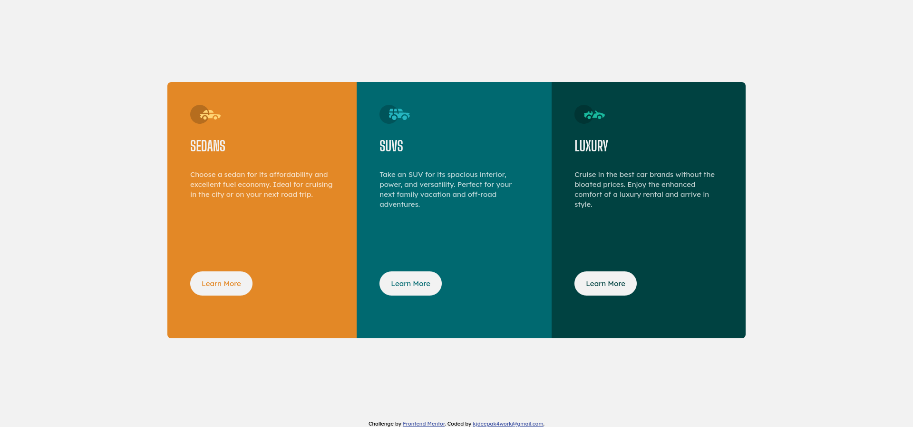

# Frontend Mentor - 3-column preview card component solution

This is a solution to the [3-column preview card component challenge on Frontend Mentor](https://www.frontendmentor.io/challenges/3column-preview-card-component-pH92eAR2-). Frontend Mentor challenges help you improve your coding skills by building realistic projects.

## Table of contents

- [Overview](#overview)
  - [Screenshot](#screenshot)
  - [Links](#links)
- [My process](#my-process)
  - [Built with](#built-with)
  - [What I learned](#what-i-learned)
  - [Useful resources](#useful-resources)
- [Author](#author)

## Overview

### Screenshot

### Links

- Solution URL: [https://github.com/kjdeepak/3-column-preview-card-component](https://github.com/kjdeepak/3-column-preview-card-component)
- Live Site URL: [https://3-column-preview-card-component-kjdeepak.vercel.app/](https://3-column-preview-card-component-kjdeepak.vercel.app/)

## My process

### Built with

- Semantic HTML5 markup
- CSS custom properties
- Flexbox
- Mobile-first workflow

### What I learned

How to align button to bottom irrespective of card size

### Useful resources

- [CSS Rules](http://getbem.com/introduction/) - For CSS styling methodology

## Author

- Website - [K J Deepak](https://kjdeepak.com/)
- Github - [@kjdeepak](https://github.com/kjdeepak)
- Frontend Mentor - [@kjdeepak](https://www.frontendmentor.io/profile/kjdeepak)
- Twitter - [@k_j_deepak](https://www.twitter.com/k_j_deepak)